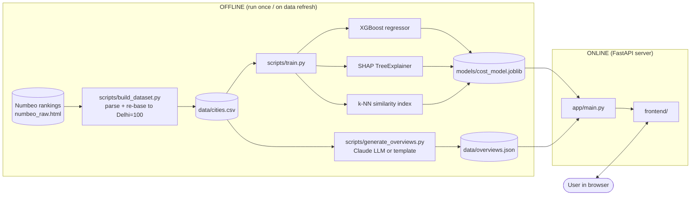
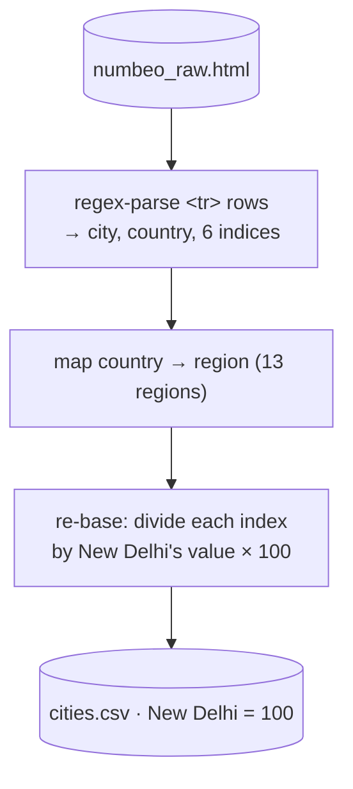
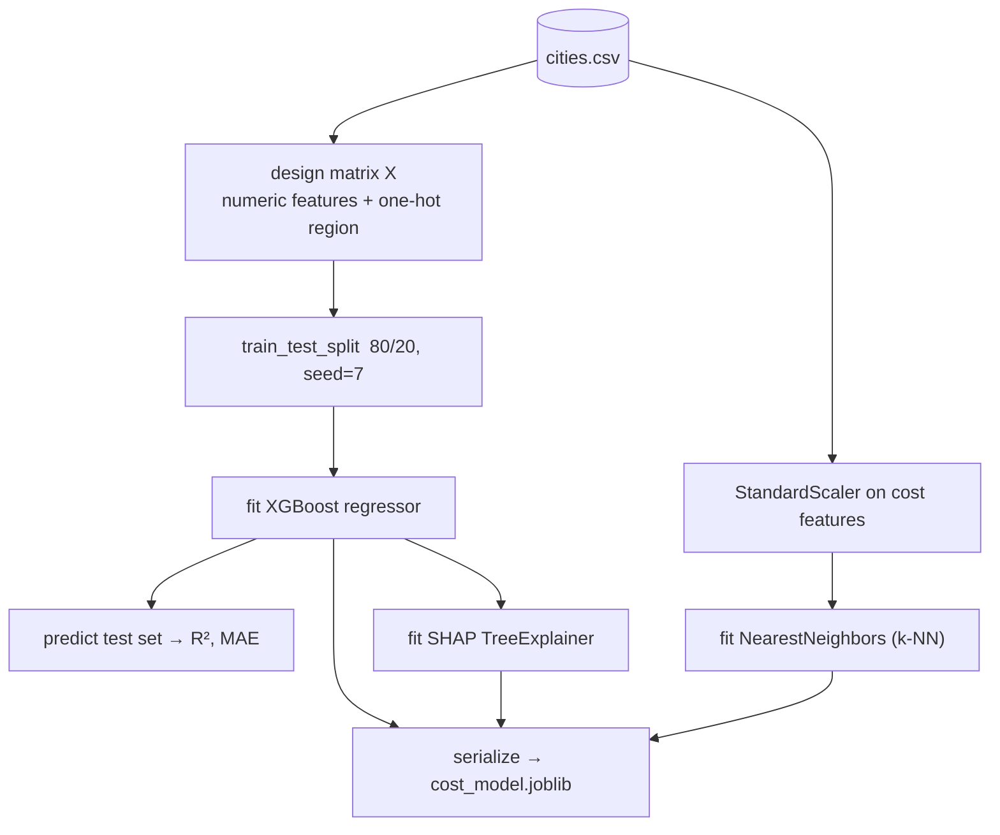
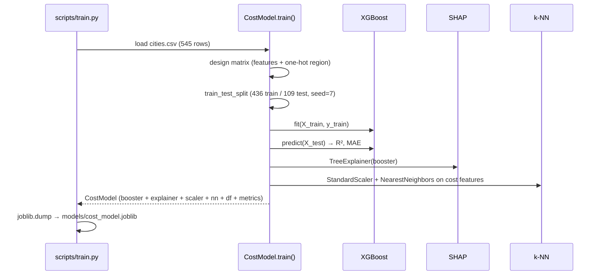
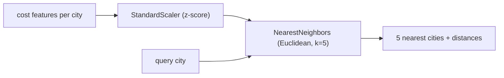
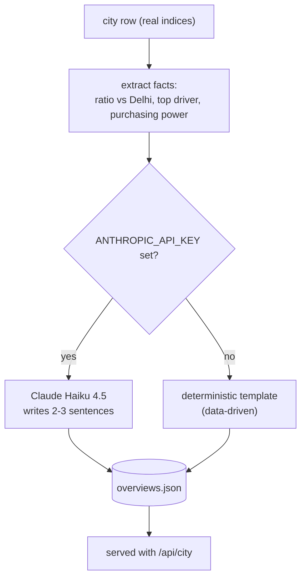
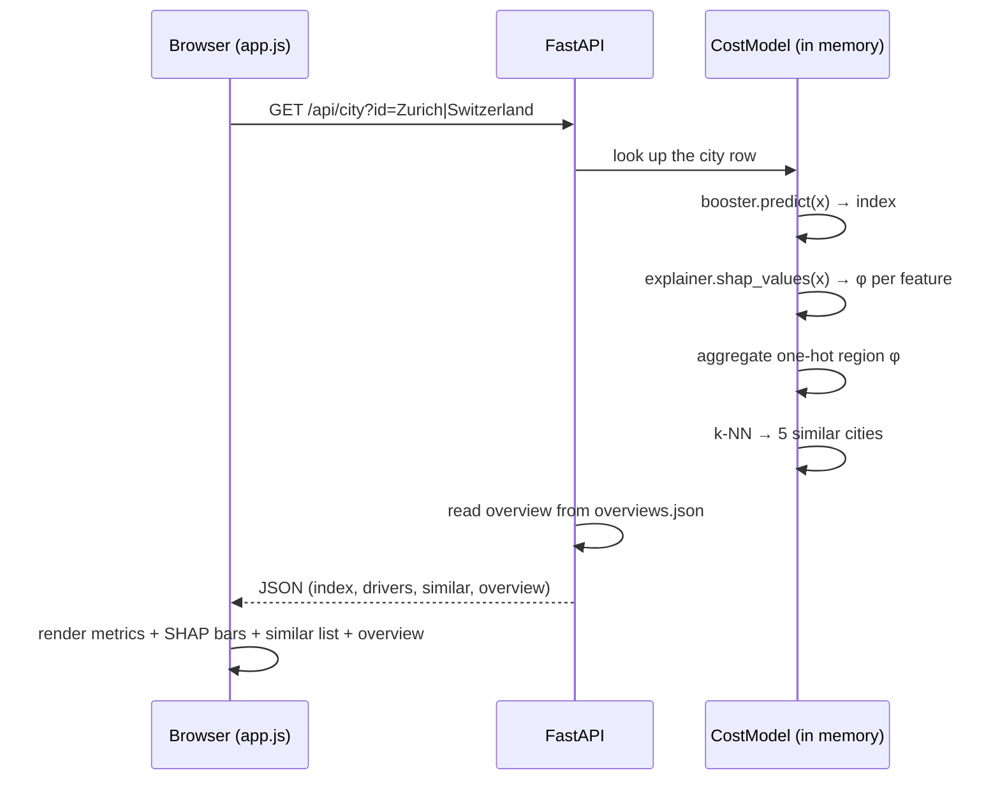

# How It Works — A Scientific Walk-Through of the Cost of Living Explainer

> This document explains the **science and engineering** behind the app end-to-end: where
> the **real data** comes from, how it is parsed and re-based to **New Delhi = 100**, how
> the machine-learning model is trained, how predictions are turned into **explanations**,
> how each city's written **overview** is produced, and how every number on screen is
> computed.
>
> It is written to be self-contained. Read it top to bottom and you will understand exactly
> what the model does and why — no hand-waving.

---

## Table of contents

1. [The problem we are modelling](#1-the-problem-we-are-modelling)
2. [System overview](#2-system-overview)
3. [The data — a real source](#3-the-data--a-real-source)
4. [Parsing and re-basing to New Delhi = 100](#4-parsing-and-re-basing-to-new-delhi--100)
5. [Feature dictionary](#5-feature-dictionary)
6. [The machine-learning pipeline](#6-the-machine-learning-pipeline)
7. [The model — gradient-boosted trees (XGBoost)](#7-the-model--gradient-boosted-trees-xgboost)
8. [How the model is trained](#8-how-the-model-is-trained)
9. [Evaluation — does it actually work?](#9-evaluation--does-it-actually-work)
10. [Explainability — SHAP](#10-explainability--shap)
11. [What the model finds](#11-what-the-model-finds)
12. [The similarity engine](#12-the-similarity-engine)
13. [Per-city overviews (LLM + fallback)](#13-per-city-overviews-llm--fallback)
14. [Serving — what happens on each request](#14-serving--what-happens-on-each-request)
15. [Limitations & honest caveats](#15-limitations--honest-caveats)
16. [Reproducibility](#16-reproducibility)
17. [Glossary](#17-glossary)
18. [References](#18-references)

---

## 1. The problem we are modelling

**Cost of living** is the money needed to sustain a standard of living — housing, food,
transport and other essentials. Economists summarise it with a **cost-of-living index**:
a single number that lets you compare places on a common scale.

Numbeo, our data source, publishes indices relative to **New York City = 100**. This app
**re-bases everything to New Delhi = 100** — so a city with a total-cost index of 300 costs
roughly three times as much as New Delhi, and a purchasing-power index of 150 means local
salaries stretch about 1.5× as far as Delhi's.

The scientific question is **not** simply *"what is the index?"* (forecasting). It is the
**decomposition question**:

> *Given that City X has a total-cost index of 300, **how much of that** is rent, how much
> groceries, how much eating out?* And **globally**, *which factors move the cost of living
> the most across all cities?*

That decomposition is what turns a black-box prediction into **understanding**, and it is
answered with **SHAP** (Section 10).

---

## 2. System overview



Heavy computation (parsing, training, overview generation) happens **once, offline**;
**serving is cheap** — a forward pass, a SHAP lookup, and a cache read, in milliseconds.

---

## 3. The data — a real source

**Source: [Numbeo — Cost of Living Index by City](https://www.numbeo.com/cost-of-living/rankings_current.jsp)**,
the most widely cited cross-city cost-of-living reference. Numbeo aggregates crowd-sourced
prices for ~90 items per city into category indices.

The rankings table is server-rendered HTML; a snapshot is cached at
`backend/data/numbeo_raw.html` for **provenance and reproducibility**. The columns we use
(all published relative to New York City = 100):

| Numbeo column | Meaning |
|---|---|
| Cost of Living Index | Consumer prices **excluding** rent |
| Rent Index | Apartment rents |
| Cost of Living Plus Rent Index | Consumer prices **including** rent — our **target** |
| Groceries Index | Supermarket basket |
| Restaurant Price Index | Meals & drinks out |
| Local Purchasing Power Index | What local *net salaries* can buy |

The snapshot contains **545 cities across 116 countries** — global coverage including
27 Indian cities, which is what makes a New Delhi baseline meaningful.

> **Provenance, stated plainly:** this is real, third-party observational data. We did not
> generate it. To refresh, delete `numbeo_raw.html` and re-run `build_dataset.py` — it
> re-fetches the live table.

---

## 4. Parsing and re-basing to New Delhi = 100



**Parsing.** `build_dataset.py` extracts each table row's city, country and six numeric
indices, then maps the country to one of 13 world regions (South Asia, Western Europe, …).

**Re-basing.** Numbeo's scale is NYC = 100. We convert to **New Delhi = 100** by dividing
every index column by New Delhi's value in that column and multiplying by 100:

$$
\text{index}^{\text{Delhi}}_{c,k} = \frac{\text{index}^{\text{NYC}}_{c,k}}{\text{index}^{\text{NYC}}_{\text{Delhi},k}}\times 100
$$

for city $c$ and column $k$. By construction New Delhi becomes 100 on every axis, and each
other city reads as a clean multiple of Delhi. (Example: Zurich's total-cost index ≈ 663 —
about 6.6× Delhi; its rent ≈ 1080 — about 10.8× Delhi.)

---

## 5. Feature dictionary

All values are indices where **New Delhi = 100**.

| Column | Type | Meaning | Role |
|---|---|---|---|
| `city`, `country`, `region` | text | Identity & geography | id / one-hot |
| `rent_index` | float | Apartment rents | **feature** |
| `groceries_index` | float | Supermarket basket | **feature** |
| `restaurant_index` | float | Eating out | **feature** |
| `purchasing_power_index` | float | What local salaries buy (higher = wages stretch further) | **feature** |
| `cost_of_living_index` | float | Consumer prices excl. rent | reference |
| `total_cost_index` | float | Consumer prices **incl. rent** | **target (y)** |

The model predicts `total_cost_index` from rent, groceries, restaurants, purchasing power,
and a one-hot `region`.

---

## 6. The machine-learning pipeline



**Feature engineering** is deliberately minimal and transparent:
- Numeric features are passed **as-is** — tree models split on thresholds, so they are
  scale-invariant and need no normalization.
- `region` is **one-hot encoded** into 13 binary columns.
- The similarity engine (only) standardizes the cost features, because k-NN uses Euclidean
  distance, which *is* scale-sensitive (Section 12).

---

## 7. The model — gradient-boosted trees (XGBoost)

### 7.1 Why this model

| Requirement | Why XGBoost fits |
|---|---|
| Non-linearities + interactions | Trees model them natively |
| Tabular data, ~500 rows | Gradient-boosted trees are state-of-the-art on tabular data |
| Must be **explainable** | **TreeSHAP** gives *exact*, fast Shapley values for tree ensembles |
| Mixed feature scales | Trees are scale-invariant |
| Overfitting risk | L2 regularization, shrinkage, subsampling built in |

### 7.2 The math, briefly

Gradient boosting builds an **additive ensemble** of $K$ regression trees:

$$
\hat{y}_i = \sum_{k=1}^{K} f_k(x_i), \qquad f_k \in \mathcal{F}\ (\text{regression trees})
$$

minimising a **regularised objective**:

$$
\mathcal{L} = \sum_i \ell(y_i, \hat{y}_i) \;+\; \sum_k \Omega(f_k), \qquad
\Omega(f) = \gamma T + \tfrac{1}{2}\lambda \lVert w \rVert^2
$$

where $\ell$ is squared error, $T$ the number of leaves, $w$ the leaf weights, and
$\gamma,\lambda$ penalise complexity. Trees are added one at a time, each fit to the
**second-order Taylor approximation** of the loss; a **learning rate** $\eta$ shrinks each
tree's contribution so the ensemble generalises:

$$
\hat{y}^{(t)}_i = \hat{y}^{(t-1)}_i + \eta\, f_t(x_i)
$$

### 7.3 Hyperparameters

```python
XGBRegressor(
    n_estimators=500, max_depth=4, learning_rate=0.05,
    subsample=0.9, colsample_bytree=0.9, reg_lambda=1.0, random_state=7,
)
```

`max_depth=4` lets trees capture multi-way interactions while staying far from memorising
~500 rows; the small learning rate with many trees favours generalisation.

---

## 8. How the model is trained



Training takes a few seconds. The artifact bundles everything needed to serve — model,
explainer, similarity index, and the reference dataset with cached predictions.

---

## 9. Evaluation — does it actually work?

We hold out **20 %** of cities the model never sees during fitting:

| Metric | Meaning | Result (seed 7) |
|---|---|---:|
| **R²** | Fraction of variance in total cost explained (1.0 = perfect) | **0.994** |
| **MAE** | Average miss, in index points (New Delhi = 100 scale) | **6.5** |
| Test cities | Hold-out size | 109 |

**Interpretation:** on unseen cities, the model predicts the total-cost index to within
~6.5 points and explains 99 % of the variance. High R² is expected here because the target
(total cost incl. rent) is, by Numbeo's own construction, largely a basket of the very
components we feed in — so the model is learning a real but tightly-coupled relationship.
That is precisely why the *decomposition* (which component dominates) is the interesting
output, not the headline accuracy.

---

## 10. Explainability — SHAP

A prediction of "300" is useless for *understanding*. We need to **attribute** it to its
causes, using **SHAP (SHapley Additive exPlanations)**.

### 10.1 Shapley values — the game-theory foundation

SHAP comes from **cooperative game theory** (Lloyd Shapley, 1953). Treat the features as
players cooperating to produce the prediction (the payout). The **Shapley value** $\phi_i$
is the unique fair division of the payout — each feature's average marginal contribution
over all orderings in which features could be added:

$$
\phi_i = \sum_{S \subseteq N \setminus \{i\}}
\frac{|S|!\,(|N|-|S|-1)!}{|N|!}\,\Big[\,v(S \cup \{i\}) - v(S)\,\Big]
$$

where $N$ is the feature set, $S$ a subset without $i$, and $v(S)$ the model's expected
output using only features in $S$.

### 10.2 The additivity guarantee

SHAP values satisfy **local accuracy** — they exactly reconstruct each prediction:

$$
\underbrace{f(x)}_{\text{prediction}} = \underbrace{\phi_0}_{\text{base value}} + \sum_{i=1}^{M} \phi_i
$$

The **base value** $\phi_0$ is the average prediction over the dataset (the "typical city").
Each $\phi_i$ is how much feature $i$ pushes *this* city above (positive, shown rust) or
below (negative, shown teal) that average — exactly the driver bars in the UI.

### 10.3 Why TreeSHAP

The exact Shapley sum is exponential in general; for tree ensembles, **TreeSHAP** computes
the *exact* values in polynomial time. Because our model is a tree ensemble, attributions
are **exact and fast**, not approximations.

### 10.4 Local vs global, and region aggregation

| Scope | Question | Computation | Endpoint |
|---|---|---|---|
| **Local** | "Why is Zurich expensive?" | SHAP values for that city | `/api/city` |
| **Global** | "What drives cost overall?" | **mean(\|SHAP\|)** across all cities | `/api/insights` |

`region` is one-hot, so SHAP returns 13 region contributions; we **sum them into a single
`region` driver** before display, so users see one honest bar instead of thirteen fragments.

---

## 11. What the model finds

Averaged over all 545 cities (mean |SHAP|):

| Driver | Mean \|SHAP\| | Rank |
|---|---:|:--:|
| Rent & housing | **38.8** | 1 |
| Groceries | 34.9 | 2 |
| Restaurants | 27.3 | 3 |
| Region | 4.4 | 4 |
| Local purchasing power | 1.6 | 5 |

**Rent & housing is the single largest driver of total cost of living**, ahead of groceries
and eating out — the central real-world insight this app surfaces. Purchasing power barely
moves the *cost* prediction (it is about wages, not prices), which is the correct behaviour:
it belongs to the **affordability** story, not the cost story.

> Honesty note: SHAP explains the **model**, and the model captures **associations** in
> observational data. "Rent drives total cost" is a statement about how Numbeo's basket is
> composed and how cities co-vary — not a controlled causal experiment.

---

## 12. The similarity engine

"Most similar cities" is a separate, **unsupervised** model answering *"which cities have a
similar cost structure?"* — not a similar total price.



We **standardize** the cost features to z-scores first, because k-NN's Euclidean distance is
dominated by large-magnitude columns; standardizing gives each category equal say, so
similarity reflects the *shape* of costs, not just the biggest number.

---

## 13. Per-city overviews (LLM + fallback)

Every city gets a short, plain-language paragraph grounded in its real numbers. Two
interchangeable backends:



- **LLM backend (preferred).** When `ANTHROPIC_API_KEY` is set, `generate_overviews.py`
  sends each city's facts to **Claude Haiku 4.5** with a strict prompt ("be factual, do not
  invent beyond the data") and caches the result.
- **Template fallback.** With no key, a deterministic template composes the same facts into
  fluent prose — so the app is fully functional offline.
- Either way, overviews are **pre-generated and cached** to `data/overviews.json`; the API
  just reads the cache (no per-request latency, no key needed at serve time).

This is genuinely LLM-*ready*: add a key, re-run one script, and every overview upgrades to
Claude-written text with no other change.

---

## 14. Serving — what happens on each request

Example: the user selects **Zurich**.



The model and overview cache load **once** at startup and stay in memory, so each request is
milliseconds. API surface: `/api/health`, `/api/cities`, `/api/city`, `/api/compare`,
`/api/insights`, `/api/predict`.

---

## 15. Limitations & honest caveats

- **Observational, associational.** SHAP explains the model; the model captures associations
  in Numbeo data. Driver claims are not controlled causal effects.
- **Crowd-sourced data.** Numbeo is community-contributed; coverage and reliability vary by
  city, and values drift over time. The cached snapshot is a point-in-time reading.
- **High R² is partly structural** (Section 9): the target is a basket of the inputs, so
  accuracy is not a claim about predicting cost from *independent* signals.
- **A single index hides inequality** — neighbourhoods, household types and informal
  economies are invisible at city granularity. Purchasing power mitigates but doesn't
  eliminate this.
- **One snapshot, no time axis** — the app doesn't forecast cost *changes*.

---

## 16. Reproducibility

| Aspect | How it's pinned |
|---|---|
| Source data | cached snapshot `data/numbeo_raw.html` |
| Re-basing | deterministic (divide by New Delhi's row) |
| Train/test split | `random_state=7` |
| Model | `random_state=7` |
| Overviews | cached `data/overviews.json` (template is deterministic) |
| Dependencies | pinned in `requirements.txt` |

Re-running `build_dataset → generate_overviews → train` reproduces the dataset, overviews,
model and metrics on the same platform.

---

## 17. Glossary

| Term | Plain-English meaning |
|---|---|
| **Cost-of-living index** | One number for how expensive a place is (here, New Delhi = 100). |
| **Re-basing** | Rescaling indices so a chosen city (New Delhi) equals 100. |
| **Feature / Target** | Model input / the value predicted (`total_cost_index`). |
| **Gradient boosting / XGBoost** | Many small decision trees built in sequence, each correcting the last. |
| **One-hot encoding** | Turning a category (region) into 0/1 columns. |
| **R² / MAE** | Variance explained / average error size. |
| **Shapley value / SHAP** | A fair, game-theoretic share of the prediction per feature. |
| **TreeSHAP** | Exact, fast SHAP for tree models. |
| **Base value (φ₀)** | The average prediction; SHAP measures deviations from it. |
| **k-NN** | k-nearest-neighbours; closest items by distance. |
| **Purchasing power** | What local net salaries can buy (higher = wages stretch further). |

---

## 18. References

1. Chen, T. & Guestrin, C. (2016). *XGBoost: A Scalable Tree Boosting System.* KDD.
2. Lundberg, S. & Lee, S. (2017). *A Unified Approach to Interpreting Model Predictions.* NeurIPS. (SHAP)
3. Lundberg, S. et al. (2020). *From local explanations to global understanding with explainable AI for trees.* Nature Machine Intelligence. (TreeSHAP)
4. Shapley, L. (1953). *A Value for n-Person Games.*
5. Friedman, J. (2001). *Greedy Function Approximation: A Gradient Boosting Machine.* Annals of Statistics.
6. Numbeo. *Cost of Living Indices — methodology.* https://www.numbeo.com/cost-of-living/cpi_explained.jsp
7. Pedregosa, F. et al. (2011). *scikit-learn: Machine Learning in Python.* JMLR.

---

*This document describes the system as implemented in `backend/`. If you change the model,
data, or hyperparameters, refresh the numbers in Sections 9 and 11 by re-running
`python -m scripts.train` (it prints fresh metrics and global SHAP importances).*
