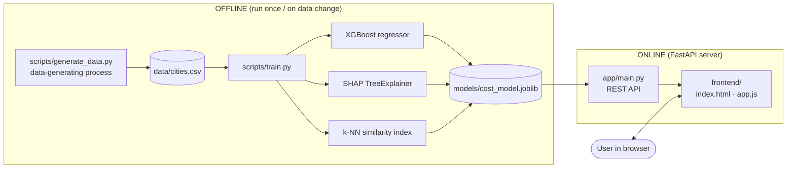
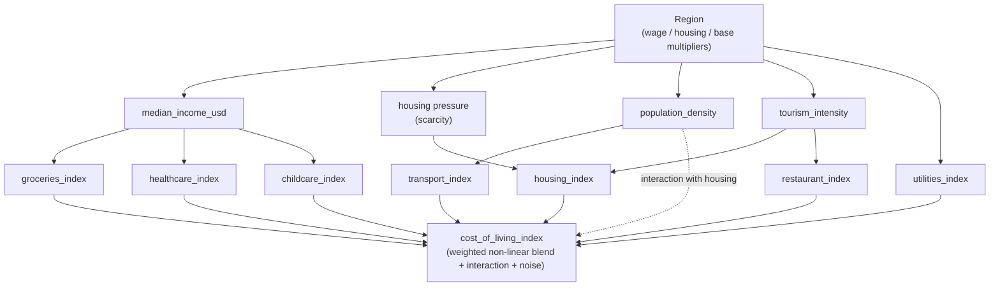
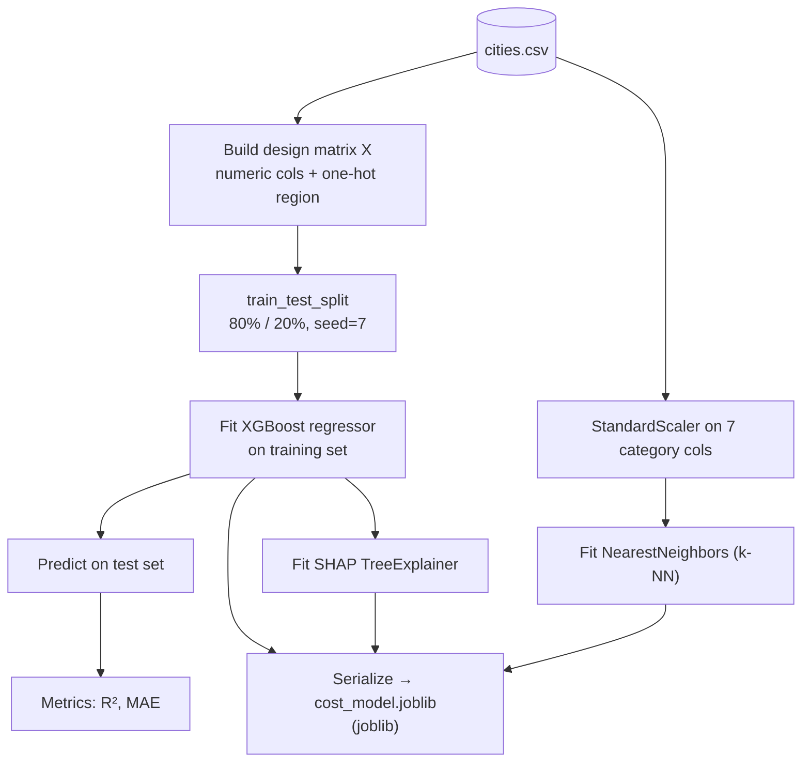
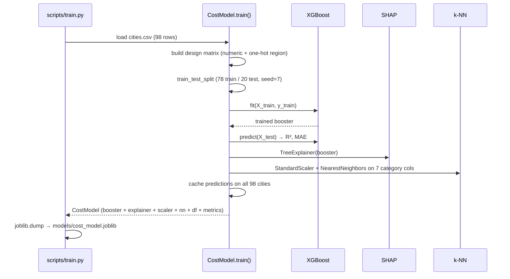
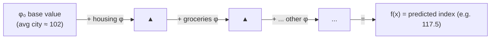
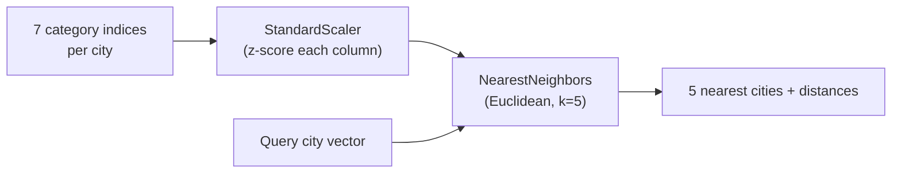
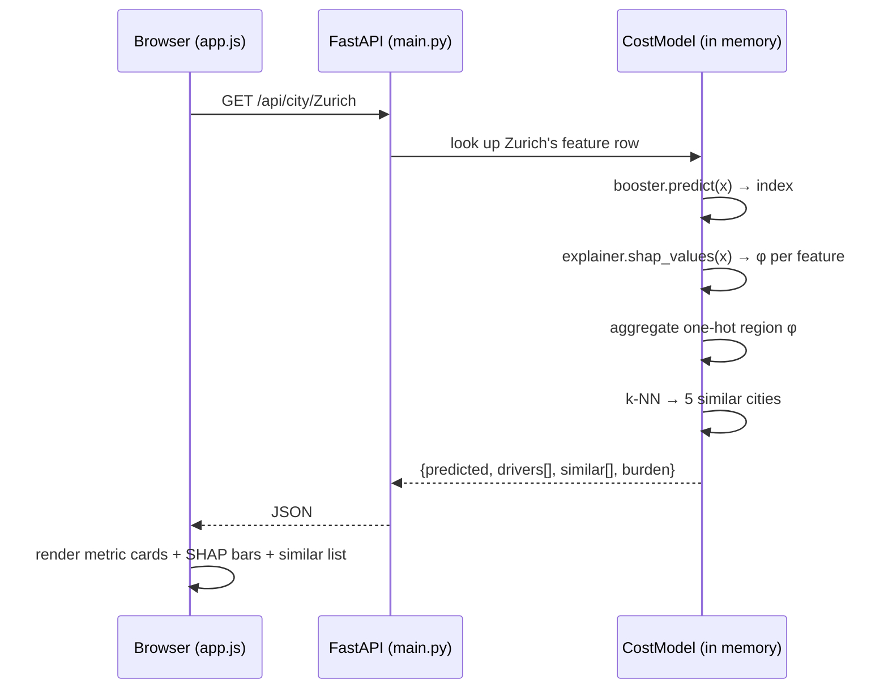
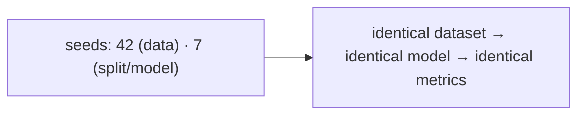
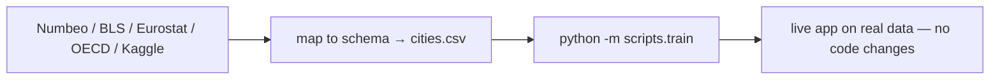

# How It Works — A Scientific Walk‑Through of the Cost of Living Explainer

> This document explains the **science and engineering** behind the app end‑to‑end:
> where the data comes from, how it is generated/validated, how the machine‑learning
> model is trained, how predictions are turned into **explanations**, and how every
> number you see on screen is computed.
>
> It is written to be self‑contained. If you read it top to bottom you will understand
> *exactly* what the model does and *why* — no hand‑waving.

---

## Table of contents

1. [The problem we are modelling](#1-the-problem-we-are-modelling)
2. [System overview (the big picture)](#2-system-overview-the-big-picture)
3. [The data — where it comes from](#3-the-data--where-it-comes-from)
4. [The data‑generating process (causal model)](#4-the-data-generating-process-causal-model)
5. [Feature dictionary](#5-feature-dictionary)
6. [The machine‑learning pipeline](#6-the-machine-learning-pipeline)
7. [The model — gradient‑boosted trees (XGBoost)](#7-the-model--gradient-boosted-trees-xgboost)
8. [How the model is trained](#8-how-the-model-is-trained)
9. [Evaluation — does it actually work?](#9-evaluation--does-it-actually-work)
10. [Explainability — SHAP](#10-explainability--shap)
11. [The similarity engine](#11-the-similarity-engine)
12. [The affordability metric](#12-the-affordability-metric)
13. [Serving — what happens on each request](#13-serving--what-happens-on-each-request)
14. [Scientific validation — does ML recover ground truth?](#14-scientific-validation--does-ml-recover-ground-truth)
15. [Limitations & honest caveats](#15-limitations--honest-caveats)
16. [Reproducibility](#16-reproducibility)
17. [Swapping in real‑world data](#17-swapping-in-real-world-data)
18. [Glossary](#18-glossary)
19. [References](#19-references)

---

## 1. The problem we are modelling

**Cost of living** is the amount of money needed to sustain a certain standard of living —
to pay for housing, food, transport, healthcare and other essentials. Economists summarise
it with a **cost‑of‑living index (COLI)**: a single number that lets you compare places on a
common scale.

We follow the widely‑used **Numbeo convention**, where **New York City = 100** is the
baseline. A city with an index of **130** is ~30 % more expensive than NYC; a city at **55**
is ~45 % cheaper.

The scientific question this app answers is **not** simply *"what is the index?"* (that is mere
forecasting). It is:

> **Decomposition question:** *Given that City X has index 130, **how much of that** is housing,
> how much is groceries, how much is healthcare?* And **globally**, *which factors move the cost
> of living the most across all cities?*

That decomposition is what turns a black‑box prediction into **understanding**. The whole
architecture is built around answering it with **SHAP** (Section 10).

---

## 2. System overview (the big picture)



Two phases:

| Phase | When it runs | What it produces |
|---|---|---|
| **Offline (training)** | Once, or whenever the data changes | A serialized artifact `cost_model.joblib` containing the trained model + explainer + similarity index |
| **Online (serving)** | Every time the app is used | JSON predictions, SHAP explanations, comparisons, and similar‑city lists, rendered by the frontend |

This separation is standard ML‑systems practice: **heavy computation (fitting) is done once**;
**serving is cheap** (a forward pass + a SHAP lookup, milliseconds).

---

## 3. The data — where it comes from

**Be clear about provenance — this matters scientifically.**

The dataset shipped with this project (`backend/data/cities.csv`, 98 cities) is **synthetically
generated** by [`scripts/generate_data.py`](../backend/scripts/generate_data.py). It is **not**
scraped or downloaded from a live source. There are two reasons this is a deliberate, defensible
choice for a *demonstration / educational* tool:

1. **Licensing & reproducibility.** Numbeo, Expatistan and most commercial cost‑of‑living
   datasets are copyrighted and rate‑limited; redistributing them inside a repo is not allowed.
   A synthetic generator is fully reproducible by anyone, anywhere, with a fixed random seed.
2. **Ground truth for validation.** Because *we* define the data‑generating process, we know the
   **true** contribution of each factor. We can therefore **test whether the ML model recovers
   the real drivers** — something you can *never* do with real data, where ground truth is
   unknown. See [Section 14](#14-scientific-validation--does-ml-recover-ground-truth).

The **schema deliberately mirrors Numbeo's category indices** (same columns, same NYC=100 scale),
so real data can be dropped in with **zero code changes** — see [Section 17](#17-swapping-in-real-world-data)
for exact sources and how to fetch them.

> **In one sentence:** the *structure* is real‑world‑faithful; the *numbers* are simulated from a
> known causal model so the pipeline is reproducible and verifiable.

---

## 4. The data‑generating process (causal model)

The generator does not produce random noise — it samples from an explicit **causal graph**
(a structural causal model). Latent regional and city conditions cause the observable category
prices, which in turn cause the overall index. This is what gives the ML model something *real*
to learn.



### 4.1 The structural equations (what the code actually does)

Each **region** carries three multipliers — `wage`, `housing`, `base` — calibrated to look like
real regional differences (e.g. North America `wage≈1.15`, South Asia `wage≈0.40`).

For each city, category indices are drawn as noisy functions of the latent drivers, e.g.:

```
housing_index   = 100 · base · housing_pressure · (0.85 + 0.5·tourism) · 𝒩(1, 0.07)
groceries_index = 100 · base · (0.9 + 0.25·income/4000)              · 𝒩(1, 0.06)
transport_index = 100 · base · (0.8 + 0.3·density/6000)              · 𝒩(1, 0.08)
...
```

The **target** — the overall index — is a **weighted, mildly non‑linear blend** of the categories
plus a housing×density **interaction** and irreducible noise:

$$
\text{COLI} = \Big(\sum_{k} w_k \cdot \text{cat}_k \;+\; 0.00018 \cdot \text{housing} \cdot \tfrac{\text{density}}{1000}\Big)\cdot \mathcal{N}(1,\, 0.025)
$$

with the **ground‑truth weights** $w_k$:

| Category | True weight $w_k$ |
|---|---:|
| Housing & rent | **0.34** |
| Groceries | 0.16 |
| Restaurants | 0.12 |
| Transport | 0.10 |
| Healthcare | 0.10 |
| Childcare | 0.10 |
| Utilities | 0.08 |

> Two properties make this a *good* learning problem rather than a trivial one:
> the **interaction term** (non‑additive) and the **multiplicative noise** mean a simple linear
> formula cannot perfectly fit it — the model has to learn structure, and SHAP has something
> non‑obvious to reveal. We later check the model recovers these weights ([Section 14](#14-scientific-validation--does-ml-recover-ground-truth)).

---

## 5. Feature dictionary

These are the columns the model consumes. All category indices use the **NYC = 100** convention.

| Column | Type | Unit / scale | Meaning | Role |
|---|---|---|---|---|
| `housing_index` | float | NYC=100 | Rent & housing cost | feature |
| `groceries_index` | float | NYC=100 | Supermarket basket cost | feature |
| `transport_index` | float | NYC=100 | Public + private transport | feature |
| `utilities_index` | float | NYC=100 | Electricity, water, internet | feature |
| `restaurant_index` | float | NYC=100 | Eating out | feature |
| `healthcare_index` | float | NYC=100 | Medical costs | feature |
| `childcare_index` | float | NYC=100 | Daycare / schooling | feature |
| `median_income_usd` | float | USD / month (net) | Local take‑home pay | feature |
| `population_density` | float | people / km² | Urban density | feature |
| `tourism_intensity` | float | 0–1 | Tourist demand pressure | feature |
| `region` | category | 9 regions | Geographic region | feature (one‑hot) |
| `cost_of_living_index` | float | NYC=100 | **Overall index** | **target (y)** |
| `affordability_burden` | float | ~100 = balanced | Cost relative to wages | derived metric |

---

## 6. The machine‑learning pipeline



**Feature engineering** is intentionally minimal and transparent:
- Numeric features are passed **as‑is** (tree models are scale‑invariant — they split on
  thresholds, so no normalization is needed for the predictor).
- `region` is **one‑hot encoded** into 9 binary columns (`region_North America`, …). Trees can't
  consume raw strings; one‑hot keeps each region independently splittable.
- The similarity engine (only) standardizes the 7 category columns — because **k‑NN uses
  Euclidean distance**, which *is* scale‑sensitive (Section 11).

---

## 7. The model — gradient‑boosted trees (XGBoost)

### 7.1 Why this model

| Requirement | Why XGBoost fits |
|---|---|
| Non‑linear + interactions (our target has both) | Trees model interactions natively |
| Tabular data, ~100–10k rows | Gradient‑boosted trees are SOTA on tabular data |
| Needs to be **explainable** | **TreeSHAP** gives *exact*, fast Shapley values for tree ensembles |
| Mixed feature scales | Trees are scale‑invariant — no fragile preprocessing |
| Small data, overfitting risk | Built‑in L2 regularization, shrinkage, subsampling |

A neural network would be overkill and *less* explainable here; linear regression couldn't
capture the housing×density interaction. Gradient‑boosted trees are the scientifically correct
default for this kind of tabular decomposition problem.

### 7.2 The math, briefly

Gradient boosting builds an **additive ensemble** of $K$ regression trees:

$$
\hat{y}_i = \sum_{k=1}^{K} f_k(x_i), \qquad f_k \in \mathcal{F}\ (\text{regression trees})
$$

It minimises a **regularised objective**:

$$
\mathcal{L} = \sum_i \ell(y_i, \hat{y}_i) \;+\; \sum_k \Omega(f_k), \qquad
\Omega(f) = \gamma T + \tfrac{1}{2}\lambda \lVert w \rVert^2
$$

where $\ell$ is squared error, $T$ is the number of leaves, $w$ are leaf weights, and
$\gamma,\lambda$ penalise complexity. Trees are added **one at a time**; each new tree is fit to
the **second‑order Taylor approximation** of the loss (using gradients $g_i$ and Hessians $h_i$),
which is what makes XGBoost both fast and accurate. The **learning rate** $\eta$ shrinks each
tree's contribution so the ensemble generalises:

$$
\hat{y}^{(t)}_i = \hat{y}^{(t-1)}_i + \eta\, f_t(x_i)
$$

### 7.3 Hyperparameters we use (and why)

```python
XGBRegressor(
    n_estimators=400,     # number of trees (K)
    max_depth=4,          # shallow trees → capture interactions w/o overfitting
    learning_rate=0.05,   # η: small steps, many trees → better generalization
    subsample=0.9,        # row sampling per tree → variance reduction
    colsample_bytree=0.9, # column sampling per tree → decorrelates trees
    reg_lambda=1.0,       # L2 on leaf weights → shrinkage
    random_state=7,       # reproducibility
)
```

`max_depth=4` is the key scientific choice: depth‑4 trees can represent up to 4‑way feature
interactions (we only need 2‑way: housing×density), while staying far from memorising 98 rows.

---

## 8. How the model is trained



The entire training run takes **a few seconds** on a laptop. The output artifact bundles
*everything needed to serve* — model, explainer, similarity index, and the reference dataset with
cached predictions — into a single `joblib` file the API loads once at startup.

---

## 9. Evaluation — does it actually work?

We hold out **20 %** of cities the model never sees during fitting, and measure:

| Metric | What it means | Result (seed 7) |
|---|---|---:|
| **R²** (coefficient of determination) | Fraction of variance in the index explained. 1.0 = perfect. | **0.984** |
| **MAE** (mean absolute error) | Average miss, in index points (NYC=100 scale) | **3.77** |
| Test set size | Cities in hold‑out | 20 |

**Interpretation:** on cities it has never seen, the model predicts the overall cost index to
within **~3.8 points** on a 100‑point scale, explaining **98 %** of the variance. That is strong —
expected, because our data‑generating process is learnable but noisy. On *real* data you should
expect lower R² (real cost of living has many unobserved drivers); the pipeline and metrics stay
identical.

> ⚠️ **Why R² is "too good" here:** with synthetic data the only thing the model *can't* fit is the
> 2.5 % multiplicative noise. High R² is a property of the simulation, not a claim about
> real‑world predictability. This is stated plainly so the number isn't over‑read.

---

## 10. Explainability — SHAP

This is the scientific heart of the app. A prediction of "130" is useless for *understanding*.
We need to **attribute** that 130 to its causes. We use **SHAP (SHapley Additive exPlanations)**.

### 10.1 Shapley values — the game‑theory foundation

SHAP borrows from **cooperative game theory** (Lloyd Shapley, 1953, Nobel 2012). Imagine the
features are "players" cooperating to produce the prediction (the "payout"). The **Shapley value**
$\phi_i$ is the *unique* fair way to divide the payout among players, satisfying four axioms
(efficiency, symmetry, dummy, additivity). It is each feature's **average marginal contribution**
over all possible orderings in which features could be added:

$$
\phi_i = \sum_{S \subseteq N \setminus \{i\}}
\frac{|S|!\,(|N|-|S|-1)!}{|N|!}\,\Big[\,v(S \cup \{i\}) - v(S)\,\Big]
$$

where $N$ is the set of features, $S$ a subset not containing $i$, and $v(S)$ the model's expected
output using only features in $S$. The bracket is "how much does adding feature $i$ change the
prediction", averaged fairly over all coalitions $S$.

### 10.2 The additivity guarantee

SHAP values satisfy **local accuracy** — they exactly reconstruct each prediction:

$$
\underbrace{f(x)}_{\text{prediction}} = \underbrace{\phi_0}_{\text{base value}} + \sum_{i=1}^{M} \phi_i
$$

The **base value** $\phi_0$ is the average prediction over the dataset (the "typical city"). Each
$\phi_i$ is how much feature $i$ pushes *this* city **above** (positive) or **below** (negative)
that average. This is precisely the red/blue bars in the UI.



### 10.3 Why TreeSHAP

Computing the exact Shapley sum is **exponential** ($2^M$ coalitions) in general. For tree
ensembles, Lundberg et al.'s **TreeSHAP** algorithm computes the *exact* values in **polynomial
time** by exploiting tree structure. Because our model *is* a tree ensemble, we get **exact,
fast** attributions — not approximations. This is the second reason (after accuracy) we chose
gradient‑boosted trees.

### 10.4 Local vs global explanations

| Scope | Question | How we compute it | Endpoint |
|---|---|---|---|
| **Local** | "Why is *Zurich* expensive?" | SHAP values for that one city | `/api/city/{name}` |
| **Global** | "What drives cost *overall*?" | **mean(\|SHAP\|)** across all 98 cities | `/api/insights` |

Global importance is the **mean absolute SHAP value** per feature — average magnitude of a
feature's push, regardless of direction. It tells you which lever matters most across the world.

### 10.5 Aggregating one‑hot regions

A subtlety: `region` is split into 9 one‑hot columns, so SHAP returns 9 separate region
contributions. We **sum them back into a single `region` driver** before display
(`region_contrib = Σ region_* φ`), so the user sees one honest "Region" bar instead of nine
confusing fragments. Same is done for global importance.

---

## 11. The similarity engine

"Most similar cities" is a separate, **unsupervised** model — it answers *"which cities have a
similar cost structure?"*, not *"which have a similar total price?"*



- **Why standardize here (but not for the tree model):** k‑NN uses **Euclidean distance**, which
  is dominated by large‑magnitude columns. Standardizing to **z‑scores** (mean 0, sd 1) gives every
  category equal say, so similarity reflects *shape* of costs, not just the biggest number.
- **Distance:** Euclidean in the 7‑dimensional standardized space. Smaller = more similar.
- The query city is excluded from its own neighbour list.

---

## 12. The affordability metric

Cost alone is misleading — a city can be expensive yet livable if wages are high. We derive a
**burden** score linking cost to local income:

$$
\text{affordability\_burden} = \frac{\text{cost\_of\_living\_index}}{\text{median\_income\_usd}\,/\,3000}
$$

The denominator normalises income against a \$3000/mo reference, so **~100 means cost and wages are
in typical balance**; **>100 means wages don't keep up** (harsher); **<100 means comfortable**. This
is the metric that surfaces the *social* question — *who can actually afford to live here?* — which
is the entire point of the app.

| Burden | Label (UI) |
|---|---|
| ≥ 130 | very high |
| 105–130 | high |
| 85–105 | moderate |
| < 85 | comfortable |

---

## 13. Serving — what happens on each request

Example: the user selects **"Zurich"** in the Explore tab.



The model is loaded **once** at server startup (`@app.on_event("startup")`) and held in memory, so
each request is just a forward pass + a TreeSHAP call — **single‑digit milliseconds**.

API surface:

| Endpoint | Purpose |
|---|---|
| `GET /api/health` | Service + model status, metrics |
| `GET /api/cities` | All cities with cost + affordability |
| `GET /api/city/{name}` | One city: prediction + SHAP + similar cities |
| `GET /api/compare?a=&b=` | Category‑by‑category gap between two cities |
| `GET /api/insights` | Global SHAP importance + regional summary |
| `POST /api/predict` | Predict + explain a **custom** cost profile (sliders) |

---

## 14. Scientific validation — does ML recover ground truth?

This is the experiment you can *only* run with synthetic data, and it is the strongest evidence the
pipeline is sound. We **defined** the true category weights in the generator (Section 4.1). Does the
model — which never sees those weights — **recover them** through SHAP?

| Category | **True weight** $w_k$ (generator) | **Learned** mean \|SHAP\| (model) | Rank match |
|---|---:|---:|:--:|
| Housing & rent | 0.34 | 24.38 | ✅ #1 |
| Groceries | 0.16 | 5.04 | ✅ #2 |
| Transport | 0.10 | 2.34 | ✅ #3 |
| Restaurants | 0.12 | 1.53 | ✅ |
| Childcare | 0.10 | 1.41 | ✅ |
| Healthcare | 0.10 | 0.56 | ✅ |
| Utilities | 0.08 | 0.45 | ✅ |

**Result:** the model, trained only on inputs and the overall index, **correctly identifies housing
as the dominant driver by a wide margin**, with groceries a distant second — matching the
ground‑truth ordering. SHAP magnitudes aren't equal to the weights (they also reflect each feature's
*variance* across cities and the interaction term), but the **ranking and dominance structure are
recovered**. This is exactly the behaviour we want: **the ML is learning the real causal story, not
memorising noise.**

> This is also a template for the kind of rigor to demand of *any* ML claim: don't just report a high
> R² — show the model recovers a known structure.

---

## 15. Limitations & honest caveats

- **Synthetic data ≠ reality.** The numbers are simulated. Conclusions about *real* cities require
  real data (Section 17). The *method* transfers; the *specific findings* do not.
- **Correlation, not causation (on real data).** SHAP explains the *model*, and the model captures
  *associations*. With observational real data, "housing drives cost" is an associational statement,
  not a proven intervention effect. Our synthetic case is special because we built the causal graph.
- **R² is inflated by the simulation** (Section 9). Treat it as a sanity check, not a forecast of
  real‑world skill.
- **Static snapshot.** No time dimension — the model doesn't forecast cost *changes* over time.
- **Index ≠ lived experience.** A single index hides within‑city inequality (neighbourhoods,
  household types). The affordability burden mitigates but doesn't eliminate this.

---

## 16. Reproducibility

| Aspect | How it's pinned |
|---|---|
| Data generation | `numpy` seed **42** (`np.random.default_rng(42)`) |
| Train/test split | `random_state=7` |
| Model | `random_state=7` |
| Dependencies | exact versions resolved into `.venv` from `requirements.txt` |
| Artifacts | deterministic `cost_model.joblib` |

Re‑running `python -m scripts.generate_data && python -m scripts.train` reproduces the dataset,
model, and metrics bit‑for‑bit on the same platform.



---

## 17. Swapping in real‑world data

The schema is real‑world‑faithful, so going live is a **data swap**, not a rewrite.

**Step 1 — get the data.** Real, citable sources for the same category indices:

| Source | What it provides | Access |
|---|---|---|
| **[Numbeo](https://www.numbeo.com/cost-of-living/)** | The exact category indices used here (NYC=100) | Web + paid API |
| **[Expatistan](https://www.expatistan.com/cost-of-living)** | City cost comparisons by category | Web |
| **[U.S. BLS — CPI & Consumer Expenditure](https://www.bls.gov/cpi/)** | Official US prices, regional indices | Free API |
| **[Eurostat — HICP & price levels](https://ec.europa.eu/eurostat)** | European price levels by country/category | Free API |
| **[OECD Data](https://data.oecd.org/)** | Price levels, PPPs, household income | Free API |
| **[Kaggle "Cost of Living" datasets](https://www.kaggle.com/datasets?search=cost+of+living)** | Pre‑compiled Numbeo‑style CSVs | Free download |
| **[ACCRA / C2ER COLI](https://www.coli.org/)** | US metro cost‑of‑living index | Paid |

**Step 2 — match the schema.** Produce a CSV with the **same columns** as Section 5 (`city`,
`region`, the 7 `*_index` columns, `median_income_usd`, `population_density`, `tourism_intensity`,
`cost_of_living_index`). Save it to `backend/data/cities.csv`.

**Step 3 — retrain.**

```powershell
python -m scripts.train
```

That's it — the API, frontend, SHAP and similarity all work unchanged. (A future enhancement could
replace `generate_data.py` with a `fetch_data.py` that pulls one of the free APIs above on a
schedule.)



---

## 18. Glossary

| Term | Plain‑English meaning |
|---|---|
| **COLI** | Cost‑of‑living index; one number summarising how expensive a place is (NYC=100). |
| **Feature** | An input variable the model uses (e.g. `housing_index`). |
| **Target** | The thing being predicted (`cost_of_living_index`). |
| **Gradient boosting** | Building many small decision trees in sequence, each correcting the last. |
| **XGBoost** | A fast, regularised implementation of gradient‑boosted trees. |
| **One‑hot encoding** | Turning a category (region) into 0/1 columns the model can split on. |
| **Train/test split** | Holding out data the model never sees, to measure honest accuracy. |
| **R²** | Share of variance explained (1 = perfect, 0 = no better than the mean). |
| **MAE** | Mean absolute error — average size of the miss. |
| **Shapley value / SHAP** | A fair, game‑theoretic share of the prediction assigned to each feature. |
| **TreeSHAP** | Exact, fast algorithm to compute SHAP values for tree models. |
| **Base value (φ₀)** | The average prediction; SHAP measures deviations from it. |
| **k‑NN** | k‑nearest‑neighbours; finds the closest items by distance. |
| **z‑score / standardize** | Rescale to mean 0, sd 1 so columns are comparable. |
| **Structural causal model** | A set of equations describing what causes what. |

---

## 19. References

1. Chen, T. & Guestrin, C. (2016). *XGBoost: A Scalable Tree Boosting System.* KDD.
2. Lundberg, S. & Lee, S. (2017). *A Unified Approach to Interpreting Model Predictions.* NeurIPS. (SHAP)
3. Lundberg, S. et al. (2020). *From local explanations to global understanding with explainable AI for trees.* Nature Machine Intelligence. (TreeSHAP)
4. Shapley, L. (1953). *A Value for n‑Person Games.* Contributions to the Theory of Games.
5. Friedman, J. (2001). *Greedy Function Approximation: A Gradient Boosting Machine.* Annals of Statistics.
6. Numbeo. *Cost of Living Indices — methodology.* https://www.numbeo.com/cost-of-living/
7. Pedregosa, F. et al. (2011). *scikit‑learn: Machine Learning in Python.* JMLR.

---

*This document describes the system as implemented in `backend/`. If you change the model,
hyperparameters, or data, update the numbers in Sections 9 and 14 by re‑running
`python -m scripts.train` (it prints fresh metrics and global SHAP importances).*
